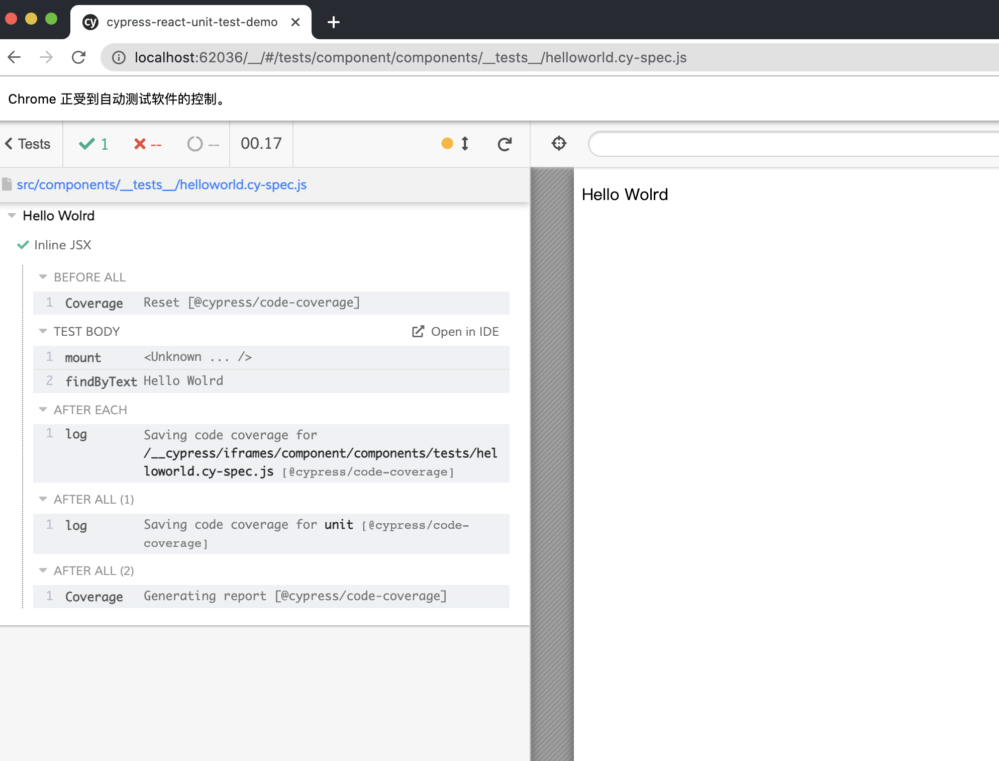
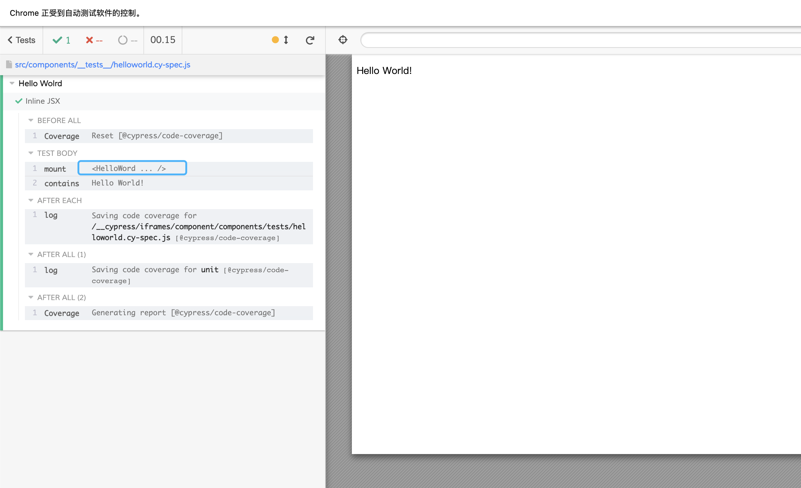
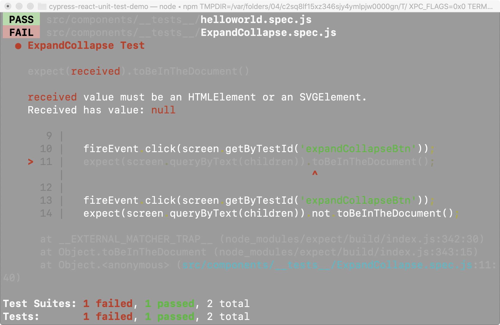

# 前言
参考自cypress官方提供的博客：[文章链接](https://glebbahmutov.com/blog/test-the-interface/)，博客提供了一个很好的例子帮助我么从Jest+React Testing Library到Cypress + cypress-react-unit-test迁移。

# 开始
首先通过CRP(create-react-app)来创建一个标准的react应用，默认情况下，通过CRP创建的应用已经内置了Jest+React Testing Library，我们可以通过查看package.json来验证：
```json
...
"dependencies": {
    "@testing-library/jest-dom": "^5.11.4",
    "@testing-library/react": "^11.1.0",
    "@testing-library/user-event": "^12.1.10",
    "react": "^17.0.1",
    "react-dom": "^17.0.1",
    "react-scripts": "4.0.1",
    "web-vitals": "^0.2.4"
},
...
```
现在来安装我们的主角cypress和cypress react单元测试插件：
```shell
npm install --save-dev cypress cypress-react-unit-test @testing-library/cypress
```
运行以下命令，进行cypress的初始化，会生成cypress的文件夹和cypress.json:
```shell
npx cypress open
```
现在可以看到cypress.json生成在项目文件夹下，cypress.json是cypress的全局配置，我们在这里启用Component Testing(单元测试)和fetch polyfill的实验功能：
```shell
{
  "experimentalComponentTesting": true,
  "experimentalFetchPolyfill": true,
  "testFiles": "**/*cy-spec.js",
  "componentFolder": "src"
}

```
在用Jest那一套进行测试的时候，我们更倾向于测试文件接近我们的源文件，但是在cypress中，所有的测试用例都集中在__tests__文件夹下。Jest默认采用后缀.spec.js去匹配测试文件，我们这里用testFiles来配置后缀为.cy-spec.js。
```
src/components/
  __tests__/
    # Jest + RTL test files
    ExpandCollapse.spec.js
    Hello.spec.js
    Login.spec.js
    Pizza.spec.js
    RemotePizza_*.spec.js
    # Cypress + CTL test files
    ExpandCollapse.cy-spec.js
    Hello.cy-spec.js
    Login.cy-spec.js
    Pizza.cy-spec.js
    RemotePizza.cy-spec.js

  # component source files
  ExpandCollapse.js
  Login.js
  Pizza.js
  RemotePizza.js
```
由于这是一篇迁移文章，我们也配置一下Jest：
```javascript
// package.json
{
  "jest": {
    "testMatch": [
      "**/__tests__/**/*.spec.js"
    ]
  }
}

```
我们的项目是由create-react-app创建的，CRP创建的项目配置存放在node_modules下的react-scripts。通过查看package.json可以看到，所有的scripts实际上都是在跑react-scripts下的命令：
```json
"scripts": {
    "start": "react-scripts start",
    "build": "react-scripts build",
    "test": "react-scripts test",
    "eject": "react-scripts eject"
},

```
为什么需要关注这个呢？我们需要让Cypress使用和react-scripts一样的配置，好让它能够理解打包机制：
```javascript
// cypress/plugins/index.js
modules.exports = (on, config) => {
  require('cypress-react-unit-test/plugins/react-scripts')(on, config);
  return config;
}

```
最后我们需要加载@testing-library/cypress和cypress-react-unit-test到Cypress support文件内，它将会引入查询命令，例如cy.findByText(类似于React Testing Library)。
```javascript
// cypress/support/index.js
// https://github.com/bahmutov/cypress-react-unit-test#install
require('cypress-react-unit-test/support');
// https://testing-library.com/docs/cypress-testing-library/intro
require('@testing-library/cypress/add-commands');

```

# Hello World
我们可以从Jest+RTL的单测例子Hello.spec.js开始，它没有对应的组件文件，因为它使用的是内联JSX：
```javascript
// src/components/__tests__/Hello.spec.js
import React from 'react';
import { render, screen } from '@testing-library/react';

test('hello world', () => {
  const { getByText } = render(<p>Hello Jest!</p>);
  expect(getByText('Hello Jest!')).toBeTruthy();
  // or
  expect(screen.getByText('Hello Jest!')).toBeTruthy();
})

```
使用cypress-react-unit-test来写相同功能的测试用例时，我们用mount来替代render，用findByText来替代getByText：
```javascript
// src/components/__tests__/Hello.cy-spec.js
import React from 'react';
import { mount } from 'cypress-react-unit-test';

it('hello world', () => {
  mount(<p>Hello Jest!</p>);
  cy.findByText('Hello Jest!');
})

```
然后我们通过如下命令来运行cypress测试：
```shell
npx cypress open
// or
yarn cypress open

```
可以看到测试通过了，类似如下

> Tip：我们关注到一点，在mount命令的Log日志里，会看到<Unknown ...>的标识。这是因为我们的组件没有命名。

在实际的测试例子中，我们渲染的组件都会有命名，可能是一个函数名称，也可能是一个class名称：
```javascript
it('hello world component', () => {
  const HelloWorld = () => <p>Hello World!</p>;
  mount(<HelloWorld>);
  // or cy.contains
  cy.findByText('Hello World!');
})

```


Cypress在e2e测试中提供的cy.contains API也能够直接使用，类似于cy.findByTextBy，如果文本不存在DOM中(4秒)，cy.contains会执行失败。如果我们的应用够快，我们可以在全局设置每次检索的等待时间，也可以在每个命令中配置。
```javascript
it('fails if text is not found', () => {
  const HelloWorld = () => <p>Hello World!</p>;
  mount(<HelloWorld>);
  cy.contains('Hello Mocha', {timeout: 200});
})

```

# 真实例子-扩大折叠组件的测试
假设有一个ExpandCollapse组件，它的功能和名字一样，展开和收缩。展开时显示传入的children，收缩时隐藏传入的children:
```javascript
const ExpandCollapse = (props) => {
  const { children } = props;
  const [isExpanded, setExpanded] = useState(false);
  return (
    <>
      <button data-testid="expandCollapseBtn" onClick={() => setExpanded(!isExpanded)}>
        click
      </button>
      {isExpanded ? children : null}
    </>
  );
}

```
如果我们要写这个组件的测试用例，首先点击Button，查看children是否显示，再点击Button，查看children是否隐藏。通过Jest写的测试用例如下（原本的示例中使用了ARIA，无障碍阅读的概念，由于这个概念想要去理解和记住成本较高，所以我这里使用了testid属性来替代）：
```javascript
// src/components/__tests__/ExpandCollapse.spec.js
import React from 'react';
import { render, screen, fireEvent } from '@testing-library/react';
import ExpandCollapse from '../ExpandCollapse.js';

it('ExpandCollapse Test', () => {
  const children = 'Hello World';
  render(<ExpandCollapse>{children}</ExpandCollapse>);
  expect(screen.queryByText(children)).not.toBeInTheDocument();
  // 通过screen.debug来查看每个阶段的DOM。
  screen.debug();

  fireEvent.click(screen.getByTestId('expandCollapseBtn'));
  expect(screen.queryByText(children)).toBeInTheDocument();
  screen.debug();

  fireEvent.click(screen.getByTestId('expandCollapseBtn'));
  expect(screen.queryByText(children)).not.toBeInTheDocument();
  screen.debug();
});

```

让我们来看看同等的测试用例，这次使用cypress和cypress-react-unit-test来编写：
```javascript
import React from 'react';
import { mount } from 'cypress-react-unit-test';
import ExpandCollapse from '../ExpandCollapse';

it('ExpandCollapse Test', () => {
  const children = 'Hello World';
  mount(<ExpandCollapse>{children}</ExpandCollapse>);  
  cy.findByText(children).should('not.exist');

  cy.findByTestId('expandCollapseBtn').click();
  cy.findByText(children); // 内置断言

  cy.findByTestId('expandCollapseBtn').click();
  cy.findByText(children).should('not.exist');
});
```
上面的两个测试用例都是同步的（点击后立即断言），但是实际上，每一个交互动作，例如点击按钮，都是异步的，也就是执行完这个动作后的效果，应该是异步的，例如我们把刚刚的Button点击事件修改一下（实际上不管加不加setTimeout，都是一个异步的宏任务）：
```javascript
<button data-testid="expandCollapseBtn" onClick={() => setTimeout(() => setExpanded(!isExpanded), 1000)}>
  click
</button>

```
使用Jest执行测试用例，可以看到报错信息:  


> 实际上，即使刚刚的测试用例改成0ms，用Jest进行测试也会报错。使用Cypress去执行测试用例，可以看到没有报错，这是由于Cypress的命令是异步的，即使我们把组件的更新从同步改成异步，或者设置delay，Cypress的Test Runner依旧会重复尝试命令直到DOM更新。